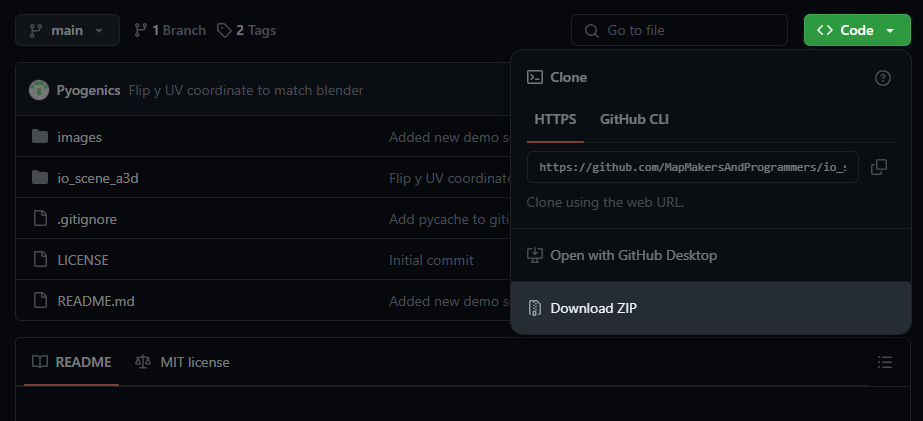
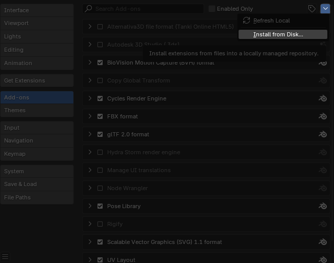
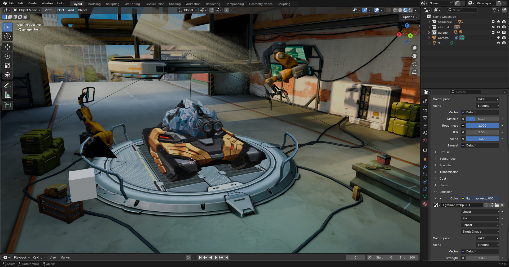
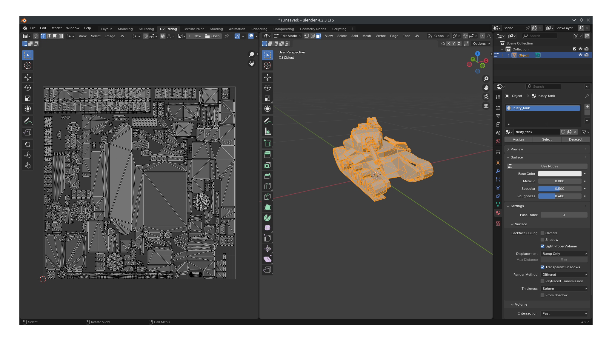
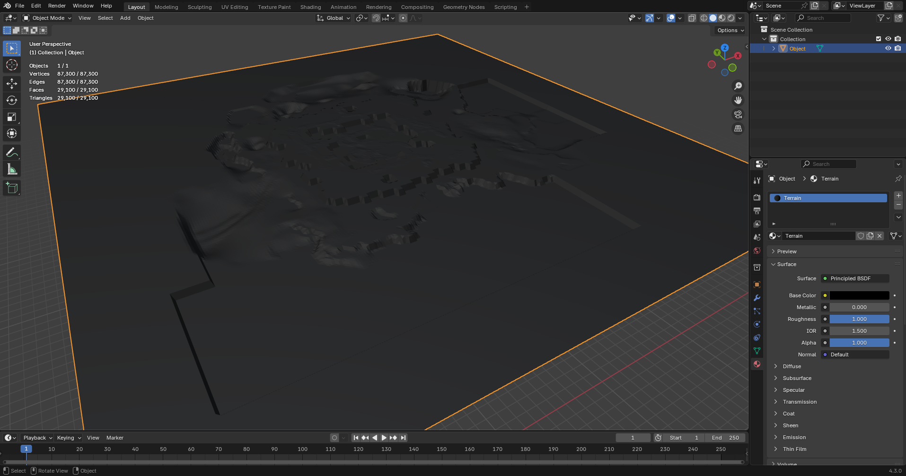

# WIP io_scene_a3d
Blender plugin to import the proprietary model format `A3D` used by the game [Tanki Online](https://tankionline.com/en/) from [Alternativa Games](https://alternativa.games/), it is not compatible with older the formats used by the flash based Alternativa3D engine (see [this plugin by Davide Jones](https://github.com/davidejones/alternativa3d_tools) instead).

## File format
Check the wiki for file format documentation.

## Installation
### Requirments: Blender version 4.2+

Firstly download the repository by clicking the "Code" button and then "Download ZIP". 
 

In blender, go to Edit > Preferences and click the "add-ons" button. From there click the arrow on the top right and click "Install from disk". 
 

Select the zip folder you downloaded and you should be good to go.

## Demo
 
 

## Status
### Work in progress, the project is mostly complete for readonly file access.
### A3D1
No support, I have never seen one of these files and 99.999% of people will only be using A3D2 and A3D3 files so there isn't much point supporting them.
### A3D2
Full readonly support, not all data is imported into blender.
#### Import
- [x] Materials
- diffuse map data is not used by the plugin because it references files that are only accessible if you work at Alternativa Games (such as texture `.psd` source files)
- [x] Meshes
- - [x] Submesh data
- - [x] Coordinates
- - [ ] Normals (data not imported into blender)
- - [x] UVs
- - [ ] Vertex colour (data not imported into blender, not very useful anyway)
- - [ ] Smoothing groups
- [x] Transform
- [x] Object data
#### Export
- [ ] Materials
- [ ] Meshes
- [ ] Transfoms
- [ ] Objects
### A3D3
Full readonly support, not all data is imported into blender.
#### Import
- [x] Materials
- diffuse map data is not used by the plugin because it references files that are only accessible if you work at Alternativa Games (such as texture `.psd` source files)
- [x] Meshes
- - [x] Submesh data
- - [x] Coordinates
- - [ ] Normals (data not imported into blender)
- - [x] UVs
- - [ ] Vertex colour (data not imported into blender, not very useful anyway)
- - [ ] Boundbox (data not imported into blender, blender calculates its own boundbox data)
- [x] Transforms
- [x] Objects
#### Export
- [ ] Materials
- [ ] Meshes
- [ ] Transfoms
- [ ] Objects
